# 3PL TMDONE Playwright Tests

End-to-end Playwright test automation for the 3PL TMDONE portal. The suite covers login, protected routing, dashboard metrics, drivers, orders, reports, settlement workflows, and the live Bird Eye View page.

## Application Screenshots

### Login

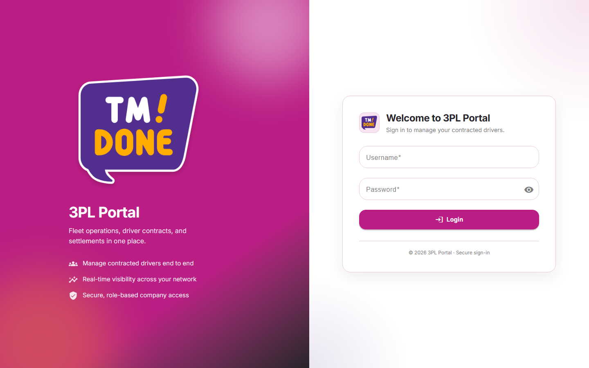

### Dashboard

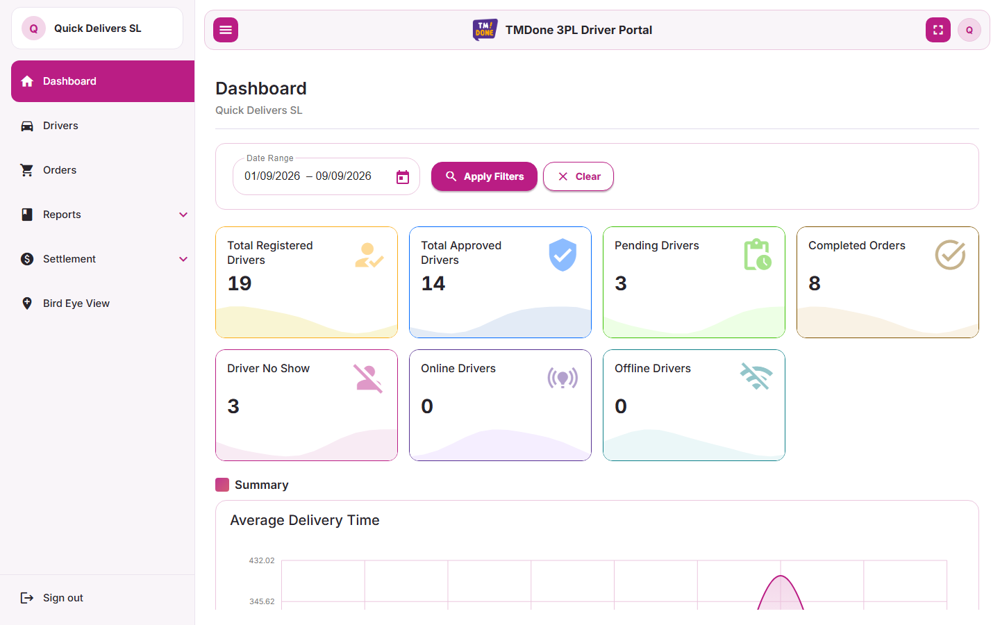

### Drivers

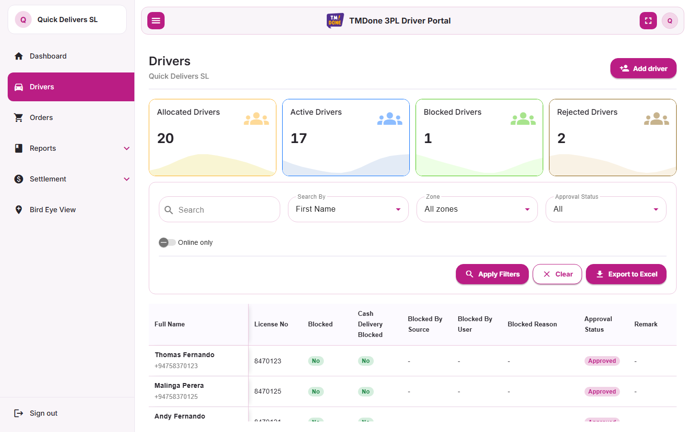

### Orders

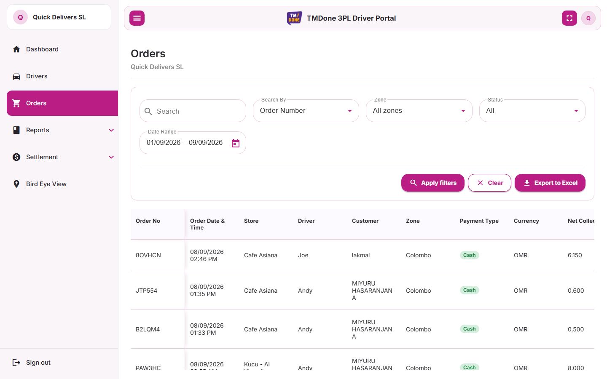

### Reports

Driver Status Report

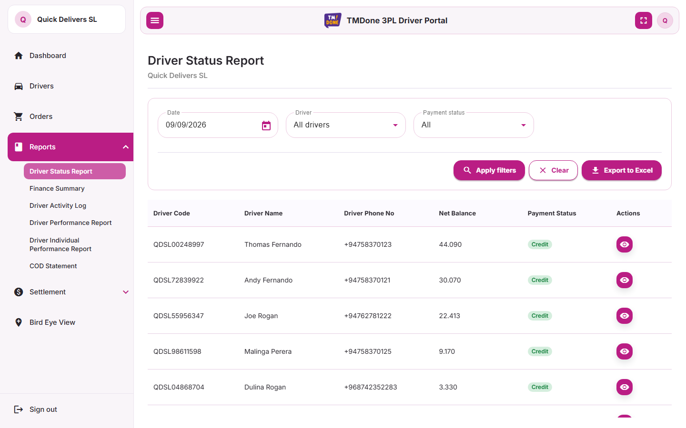

Finance Report

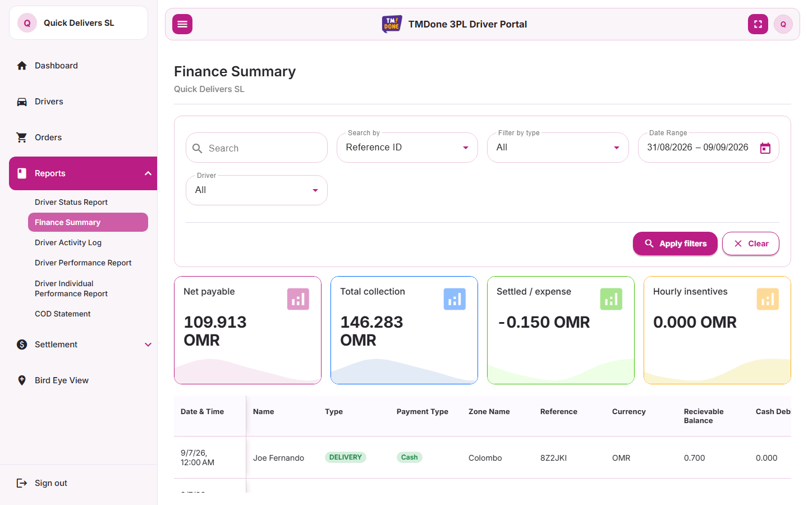

Driver Activity Report

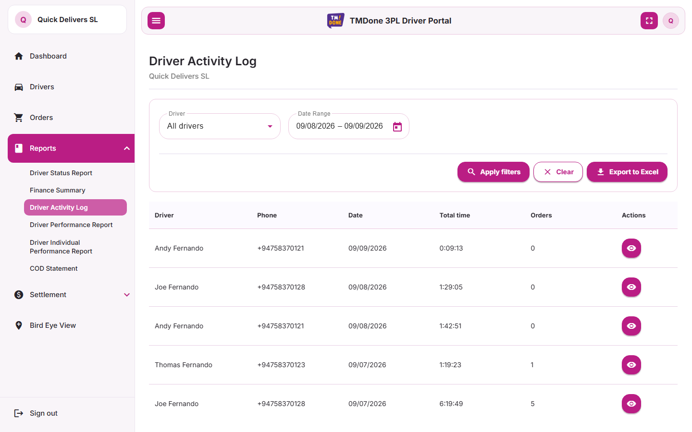

Driver Activity Details Report

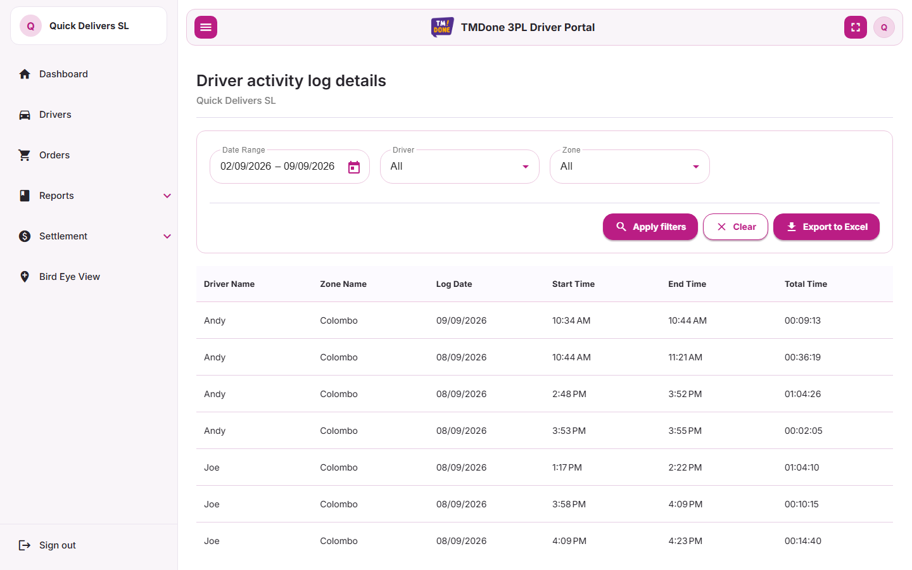

Driver Performance Report

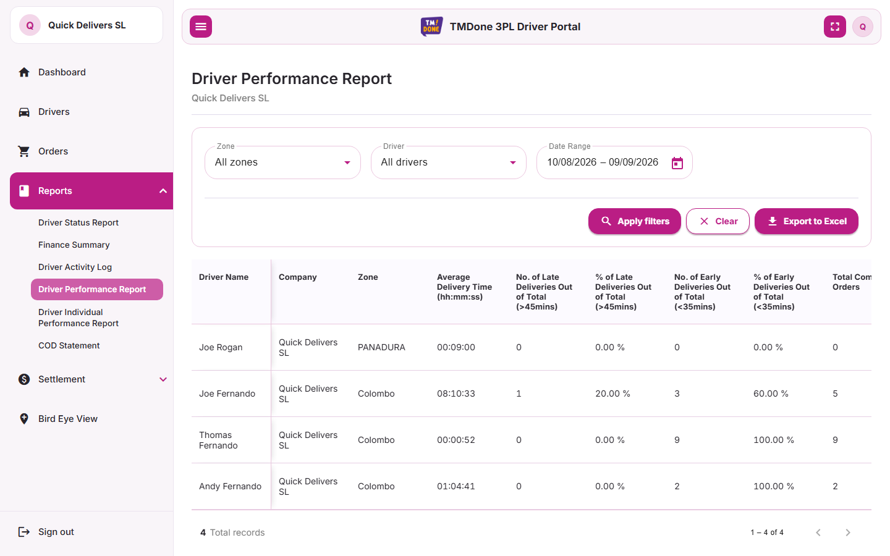

Individual Driver Performance Report

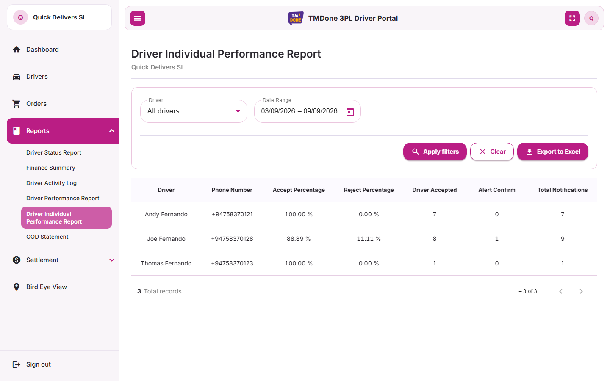

### Settlement

Company Settlement

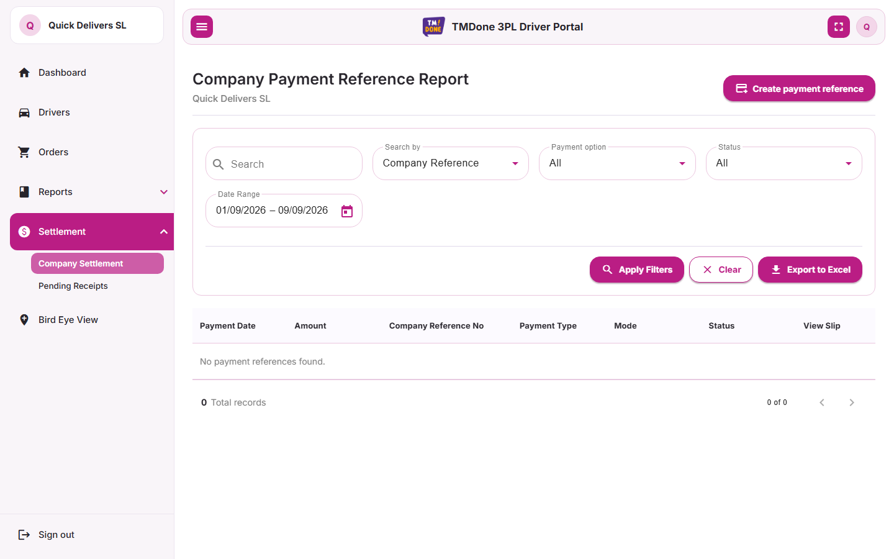

Pending Receipts

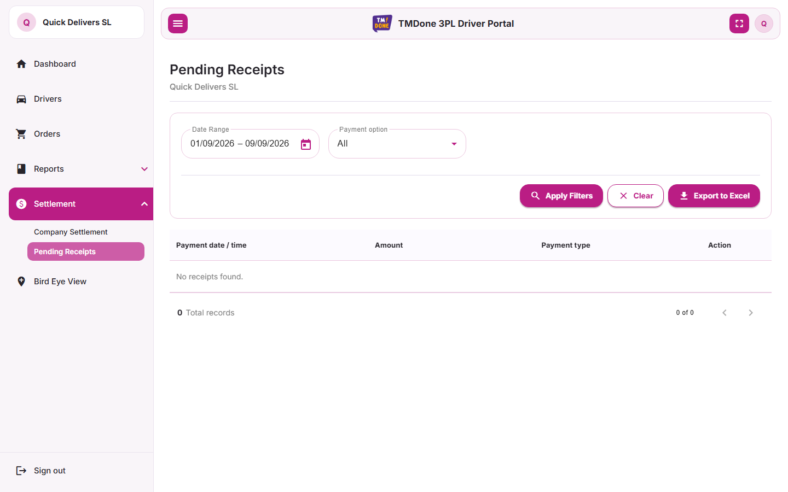

### Bird Eye View

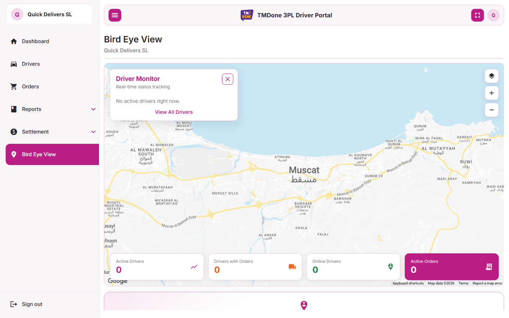

### Playwright Report

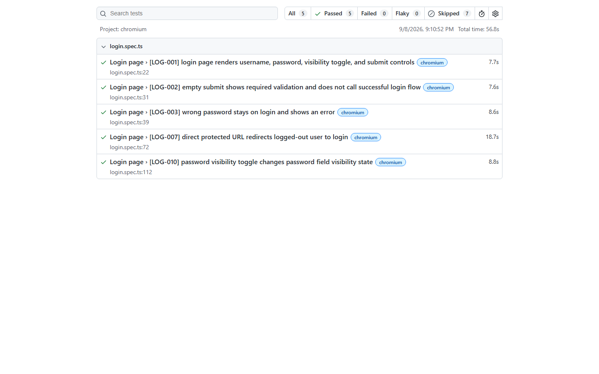

## Test Coverage

| Area | Coverage |
| --- | --- |
| Login | Form rendering, validation, invalid password handling, authenticated login, session persistence, logout, password visibility, and return URL sanitization. |
| Dashboard | KPI cards, chart presence, filter behavior, navigation from KPI cards, refresh behavior, company context, and protected routing. |
| Drivers | Filters, count cards, table columns, pagination, driver actions, add-driver form validation, export behavior, and protected routing. |
| Orders | Filters, order statuses, table columns, search, empty state, pagination, order details, export behavior, refresh behavior, and protected routing. |
| Reports | Driver status, finance, driver activity, driver activity details, driver performance, individual performance, filters, pagination, exports, and protected routing. |
| Settlement | Company settlement, pending receipts, filters, add payment, slip viewing, exports, refresh behavior, and protected routing. |
| Bird Eye View | Map surface, fleet summary, driver monitor, driver details, map controls, navigation, refresh behavior, and protected routing. |

## Running Tests Locally

Install dependencies:

```sh
npm ci
npx playwright install
```

Run the full test suite:

```sh
npm test
```

Run only Chromium:

```sh
npm run test:3pl
```

Run a single test by ID:

```sh
npm run test:id -- LOG-001
```

The public login and logged-out route tests can run without credentials:

```sh
npm test -- --project=chromium
```

Authenticated specs need credentials. Create a local `.env` file with:

```ini
THREE_PL_BASE_URL=https://3pl.demo.dr.tmd1.org
THREE_PL_ONE_COMPANY_USER=
THREE_PL_ONE_COMPANY_PASSWORD=
THREE_PL_MULTI_COMPANY_USER=
THREE_PL_MULTI_COMPANY_PASSWORD=
THREE_PL_INVALID_PASSWORD=wrong-password-123
```

Local `.env` is ignored by git. When credentials are missing, Playwright marks authenticated tests as skipped. The tests retry transient navigation errors such as `ERR_NETWORK_CHANGED` and `ERR_INTERNET_DISCONNECTED`, which can happen while navigating to the remote UAT site.

## Updating Screenshots

Screenshots can be refreshed locally when `.env` contains valid credentials:

```sh
npm run screenshots
```

They can also be refreshed from GitHub Actions by running the `Update README Screenshots` workflow manually. That workflow uses repository secrets, captures each page, and commits updated files under `docs/screenshots`.

## GitHub Actions

The workflow in `.github/workflows/playwright.yml` runs on push, pull request, manual dispatch, and every day at 2:00 AM Asia/Colombo.

GitHub Actions cron is UTC, so the configured schedule is:

```yaml
cron: '30 20 * * *'
```

After every run, the workflow emails `lakmal@codezync.com` with each test ID, test explanation, browser project, and status.

## GitHub Secrets

Add these repository secrets before relying on the scheduled workflow:

| Secret | Required | Description |
| --- | --- | --- |
| `THREE_PL_BASE_URL` | Yes | 3PL portal base URL, for example `https://3pl.demo.dr.tmd1.org`. |
| `THREE_PL_ONE_COMPANY_USER` | Yes | Username/email for the one-company test user. |
| `THREE_PL_ONE_COMPANY_PASSWORD` | Yes | Password for the one-company test user. |
| `THREE_PL_MULTI_COMPANY_USER` | Yes | Username/email for the multi-company test user. |
| `THREE_PL_MULTI_COMPANY_PASSWORD` | Yes | Password for the multi-company test user. |
| `THREE_PL_INVALID_PASSWORD` | No | Invalid password used for negative login tests. Defaults to `wrong-password-123`. |
| `SMTP_HOST` | Yes | SMTP server hostname used to send result email. |
| `SMTP_PORT` | Yes | SMTP server port, usually `587` for STARTTLS or `465` for TLS. |
| `SMTP_USERNAME` | Yes | SMTP username. |
| `SMTP_PASSWORD` | Yes | SMTP password or app password. |
| `SMTP_FROM` | Yes | Sender email address, for example `qa@codezync.com`. |
| `SMTP_SECURE` | No | Set `true` for port `465`; use `false` for STARTTLS on port `587`. |
